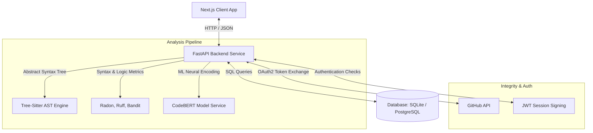

# ReviveCode: AI-Powered Code Reviewer

ReviveCode is a modern, high-fidelity code review and quality analysis platform. It combines traditional static analysis checkers (linting, security, and complexity profiling) with deep learning embeddings and anomalous logic checks powered by CodeBERT.

---

## Architecture Diagram



---

## Core Features

1. **Multi-Engine Static Review**: Performs AST nested loops checks, code complexity calculations (Radon Cyclomatic Complexity & Maintainability Index), ruff linting rules, and bandit security risk scans.
2. **CodeBERT Deep Learning Auditing**: Generates a 768-dimensional neural logic fingerprint and profiles sequences for anomalous complexity using CodeBERT.
3. **GitHub & Pull Request Automation**: Authenticate with GitHub OAuth, crawl your user profile repositories, and run full quality sweeps on select branches or open Pull Requests.
4. **Interactive Audit Dashboard**: Browse concerns in a folder explorer, select issues, view automated correction recommendations, and inspect line complexity gutters in an editor.
5. **Comprehensive Reporting**: Export review analysis sheets into PDF Reports, raw JSON files, Markdown papers (with Mermaid charts), or CSV spreadsheets.

---

## Environment Configuration

Create a `.env` file in the project directories or pass variables directly to container setups:

| Key | Scope | Default / Value | Description |
| :--- | :--- | :--- | :--- |
| `JWT_SECRET_KEY` | Backend | *(Required in Prod)* | Cryptographic key used to sign session web tokens. |
| `DATABASE_URL` | Backend | `sqlite:///` | Database connection string. Supports SQLite (local) or PostgreSQL (prod). |
| `CORS_ALLOWED_ORIGINS` | Backend | `http://localhost:3000` | Comma-separated list of browser domains allowed to request API. |
| `ENVIRONMENT` | Backend | `development` | Setting to control runtime security checks (e.g. `production`, `development`). |
| `GITHUB_CLIENT_ID` | Both | *Placeholder* | Client ID for your registered GitHub OAuth application. |
| `GITHUB_CLIENT_SECRET` | Backend | *Placeholder* | Client Secret for your registered GitHub OAuth application. |
| `NEXT_PUBLIC_API_URL` | Frontend | `http://localhost:8000` | Target URL pointing to the running backend service. |

---

## Installation & Setup

### Option A: Local Development

#### Prerequisites
- Python 3.10+
- Node.js 18+

#### 1. Setup Backend
```bash
cd backend
python -m venv .venv

# On Windows:
.venv\Scripts\activate
# On Linux/macOS:
source .venv/bin/activate

pip install -r requirements.txt
```
Run development server:
```bash
# From root package:
npm run dev:backend
# Or directly from backend folder:
uvicorn app.main:app --port 8000 --reload
```

#### 2. Setup Frontend
```bash
cd frontend
npm install
npm run dev
```

---

### Option B: Docker & Docker Compose (Production/Local Simulation)

Use Docker Compose to launch both services along with the cached model layers:

```bash
# Build and launch services in background
docker-compose up --build -d
```

For production builds using SQLite database volumes and locked production variables:
```bash
docker-compose -f docker-compose.prod.yml up --build -d
```

---

## API Documentation

FastAPI exposes interactive Swagger/OpenAPI documentation directly. Ensure the backend service is running and browse to:

- **Interactive API Docs (Swagger UI)**: [http://localhost:8000/docs](http://localhost:8000/docs)
- **Alternative Specs (ReDoc)**: [http://localhost:8000/redoc](http://localhost:8000/redoc)

### Primary Endpoints

| Method | Route | Description | Auth Required |
| :--- | :--- | :--- | :--- |
| `POST` | `/api/v1/auth/signup` | Registers a new account. Enforces strong passwords. | No |
| `POST` | `/api/v1/auth/login` | Validates credentials and returns JWT token. | No |
| `POST` | `/api/v1/review` | Performs a static and ML raw analysis on code payload. | Optional |
| `POST` | `/api/v1/upload` | Decodes source files up to 1MB size for scanning. | **Yes** |
| `POST` | `/api/v1/github/connect` | Connects current user account to GitHub OAuth. | **Yes** |
| `POST` | `/api/v1/github/review` | Triggers a scan on a remote branch. | **Yes** |
| `POST` | `/api/v1/github/pull-request/review` | Triggers a scan on a specific pull request number. | **Yes** |
| `GET` | `/api/v1/history` | Fetches historical review records for the authenticated user. | **Yes** |
